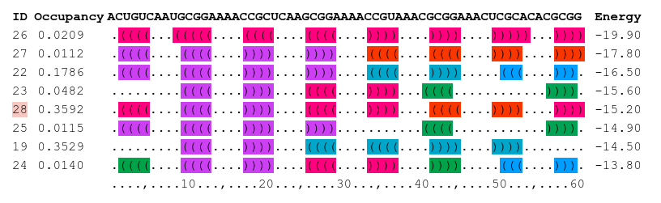
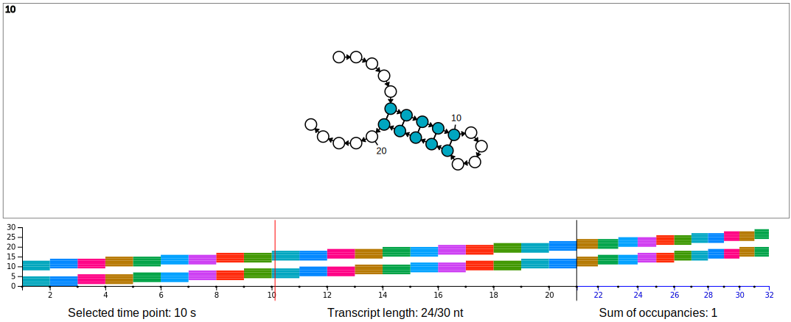

# DrForna: visualization of cotranscriptional folding

Visit [gh-pages] for a life demonstration of the app, e.g., view the example
simulation or upload your own input file.  The default input examples are part
of this repository: 
[./static/grow.drf](./static/grow.drf) and [./static/grow.fa](./static/grow.fa).

The DrForna input format is currently supported by the cotranscriptional
folding software [DrTransformer], and there exist various wrappers to generate
the DrForna input format from other cotranscriptional folding software at
[drconverters].

## Visual output description:
<!-- Referred to by static/index.html! -->

 

- The ensemble visualization area (top) presents the structure plots for a selected
  time point (the time point is marked with a vertical red line on the time
  point selection panel below):

    - Each rectangle shows a structure together with its ID in the top left
      corner.

    - The size of a rectangle is proportional to the occupancy of the
      corresponding structure.

    - Nucleotides of pairs that are part of the same helix are shown in the
      same color, unpaired nucleotides remain uncolored.

    - A mouse move over a rectangle displays the occupancy of the corresponding
      structure.
   
    - A click on a rectangle zooms in on a structure. A second click returns to
      the enemble view.

- The time point selection panel (bottom):

    - The vertical black line on the time scale marks the end of transcription,
      and also a transition from a linear time scale to a logarithmic time scale.

    - For each time point, the vertical section of the colors shown on the
      scale correspond to the nucleotide colors of the most occupied structure
      present at the selected time point.

    - A mouse click on the time scale freezes the visualization at a specific
      time point. A second click makes the time point selection panel
      responsive to mouse-over events again.

    - The Play/Pause button in the top control panel starts an animation, which
      can also be deactivated by a mouse click on the scale area.


## Main input format:

The *DrFrona input file* should be a white-space separated value ("csv-like")
file as shown in the example below: 

```
id time occupancy structure energy
6 1.47 1.0000 .((((....((((....))))....))))........  -9.30
6 1.48 1.0000 .((((....((((....))))....))))........  -9.30
9 1.49 0.1494 .........((((....))))....((((....)))). -10.00
6 1.49 0.8506 .((((....((((....))))....)))).........  -9.30
9 1.50 0.2693 .........((((....))))....((((....)))). -10.00
6 1.50 0.7306 .((((....((((....))))....)))).........  -9.30
9 1.51 0.3656 .........((((....))))....((((....)))). -10.00
6 1.51 0.6344 .((((....((((....))))....)))).........  -9.30
```

The header must have the form *id time occupancy structure energy*. 

- *id* groups structures that differ only in the number of unpaired nucleotides
  at the end. (This grouping is recommended for a better performance, but not
  mandatory. Alternatively, every structure can have a unique ID, which will
  not change in the visual output, or the same ID can be used for structures
  with different base-pairs. However, the latter may lead to unexpected
  visualization, as the colors in the time point selection panel are defined by
  first structure for each ID.)

- *time* denotes the time point at which structures are plotted in the ensemble
  visualization area.

- *occupancy* is the probability of observing the structure in the ensemble at
  the given time point.  (This affects the size of a structure plot in the
  ensemble visualization area.)

- *structure* is the structure in dot-bracket notation.  (Pseudoknots are
  denoted by different sets of parenthesis, or pairs of lowercase/uppercase
  letters.)

- *energy* is the free energy of the structure.  (The value in this field is
  not used for visualization.)


## Sequence input format (fasta, optional):

 - The _sequence_ is optional and can be either uploaded using a fasta file or
   written in the provided text box. Lines starting with the symbol ">" do not
   count as sequence, but can be used to specify the name for downloads.  Note
   that providing a sequence may cause the colors of nucleotides be perceived
   darker than corresponding colors in the time point selection panel.


## DrForna parameters:

 - _min-occupancy_: This parameter filters lines from the input file if the
   occupancy is too low. Filtering at a defined threshold helps to avoid
   performance problems, e.g. at most 100 structures can have occupancy 
   $\ge$ 0.01. Be careful with this parameter, it can remove entire time points
   from the visualization if it is set too high. 

 - _speed_: This parameter adjusts the frame rate of the animation, which
   can be triggered with the play/pause button. Note that loading structure plots
   can limit the frame rate.

## The summary table:

We also provide a summary table that displays the currently visualized part
of the DrForna input file. The order of structures is determined by the order
in the input file. (Typically, the order is by free energy, which correlates
with the probability of a structure in the equilibrated ensemble.) The dot-bracket notation
is colored to match the color scheme of helices in the main visualization area.

 


## Default color scheme:

Nucleotides engaged in base-pairs (i paired with j) are colored using the "hue"
value h=(i+j)/2 on a continuous color scale -- scaled to the full length
sequence. In principle, this ensures that colors are never repeated, unless
base-pairs are perfectly aligned.  However, as can be seen in the example
below, we chose to repeat the continuous scale four times per full-length
sequence, as this makes helices which have nearby imaginary centers better
distinguishable. 

 

The file to produce the image above is part of this repository: 
[./img/colors.drf](./img/colors.drf).


## Installation, development, and build: 

  - `npm install`

  - `npm run serve`

  - `npm run build`

For documentation, and/or testing, run:

  - `npm run jsdoc`

  - `npm run test`

All commands are defined in [package.json](package.json).


## Version

 - v0.10 -- many new features and a new layout after user feedback.

 - v0.9 -- a more or less full rewrite

<!--
## Cite
[Tanasie et al. 2022]
-->

[Tanasie et al. 2022]: <https://bioarxiv.com>
[gh-pages]: <https://viennarna.github.io/drforna>
[DrTransformer]: <https://www.github.com/viennarna/drtransformer>
[drconverters]: <https://www.github.com/bad-ants-fleet/drconverters>
